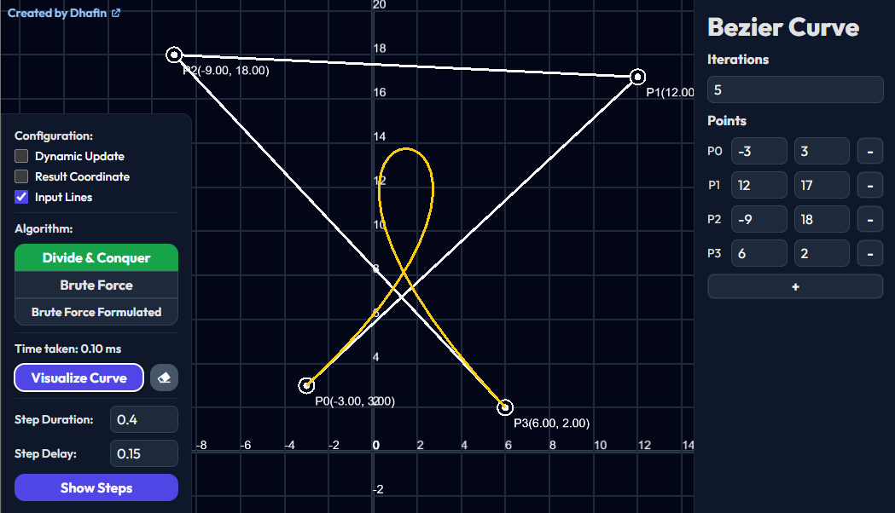
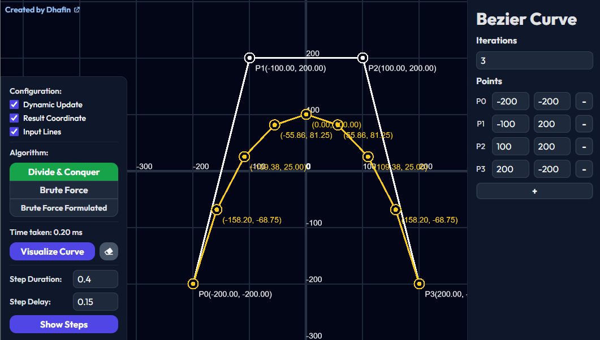
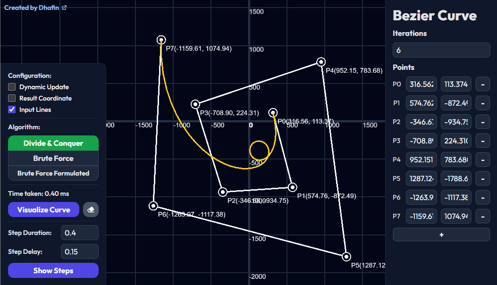
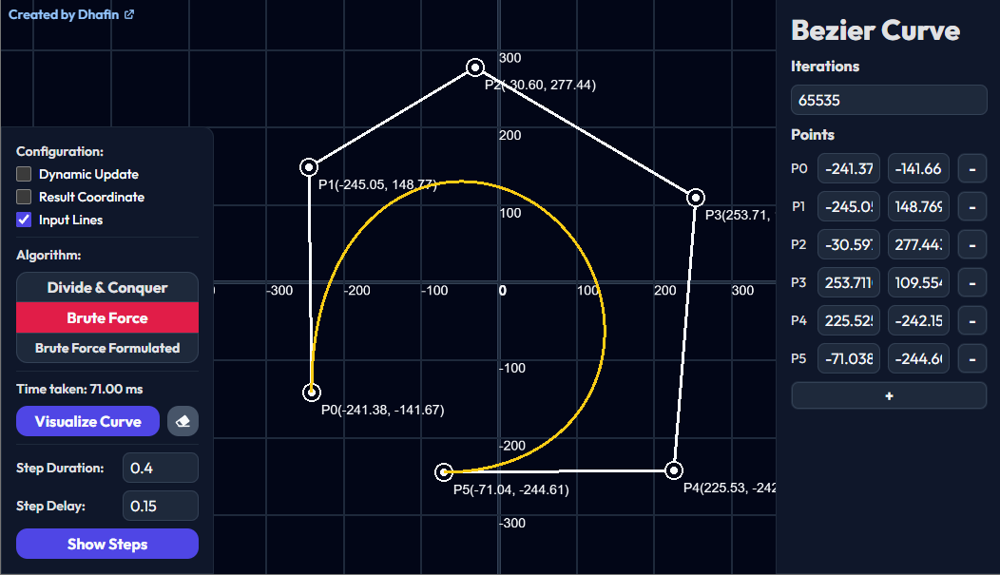
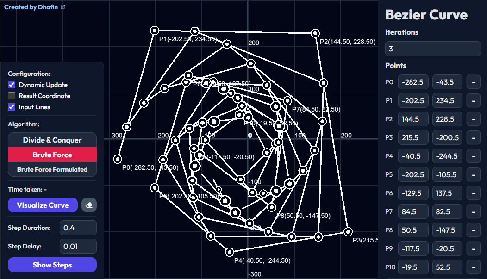
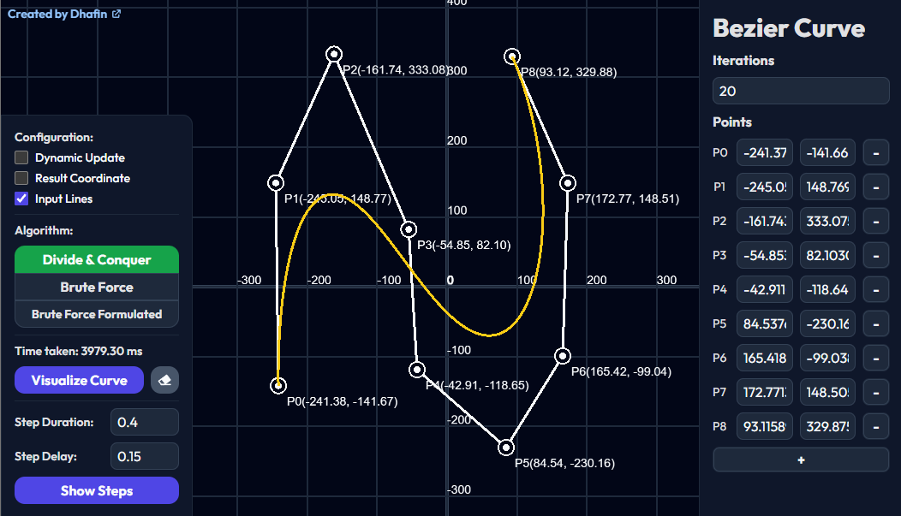
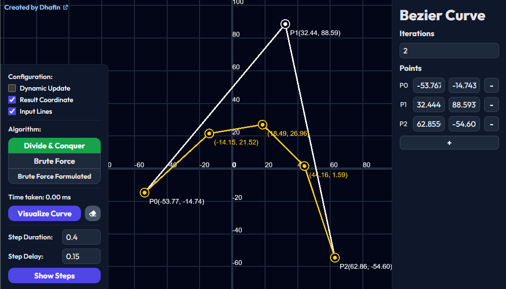
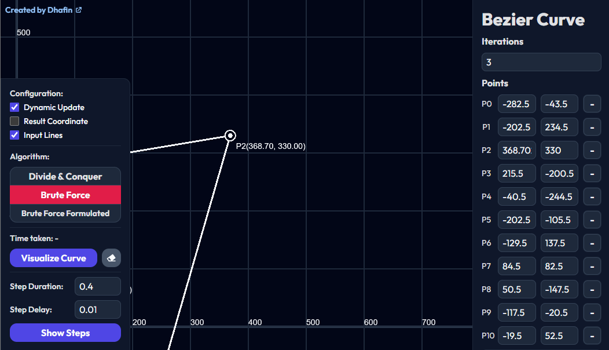

<h1 align="center">Interactive Bezier Curve Generator with Iteration Visualization</h1>
This repository contains implementation of Bezier Curve using Divide & Conquer and Brute Force Algorithm.

> 🕹️ Live demo [_here_](https://beziercurvegenerator.vercel.app).

## Made by
- 13522084 - Dhafin Fawwaz Ikramullah


## ✨ Features
- Visualize Bezier Curve
- Show animation of the generating process of the iterations
- Compare betweent the Divide & Conquer and Brute Force Algorithm
- Interactive Dragable points

## 🔍 Technologies Used
- Pixi.js
- Vite
- Node.js
- Tailwind


## 📘 How to run
For the live demo, simply open this link [_here_](https://beziercurvegenerator.vercel.app)
For the development server, make sure node is installed. Then run
```
cd src
npm install
```
To start the development server, run
```
cd src
npm run dev
```

## 🖼️ Screenshots
<p align="center" width="100%">
     
     
</p>
<p align="center" width="100%">
     
     
</p>
<p align="center" width="100%">
     
     
</p>
<p align="center" width="100%">
     
     
</p>

